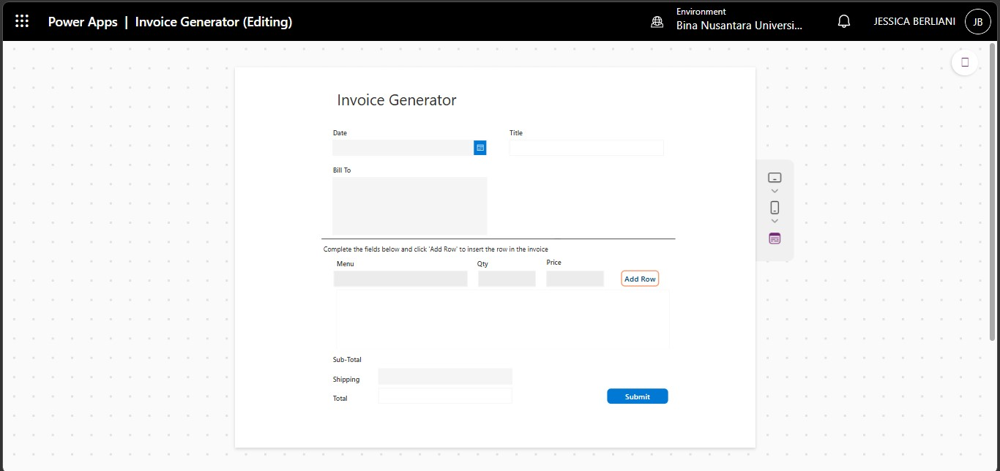

# 📄 Invoice Generator (Power Apps + Power Automate)

This project is a low-code invoice generator system built using Microsoft Power Apps and Power Automate.

It allows users to create invoices automatically and trigger workflows for processing invoice data.

---

## ✨ Key Features
- Add & remove invoice items dynamically  
- Automatic subtotal calculation  
- Shipping cost input  
- Total price calculation  
- Invoice number auto-generation  

---

## ⚙️ How It Works
1. User inputs menu, quantity, price, and shipping  
2. Power Apps calculates:
   - Subtotal  
   - Total  
3. Data is stored in SharePoint  
4. Power Automate:
   - Processes invoice data  
   - Generates formatted invoice (HTML)  
   - Sends output by email

---

## Input Form

---

## 🎥 Demo Video
(Add your video link here)

